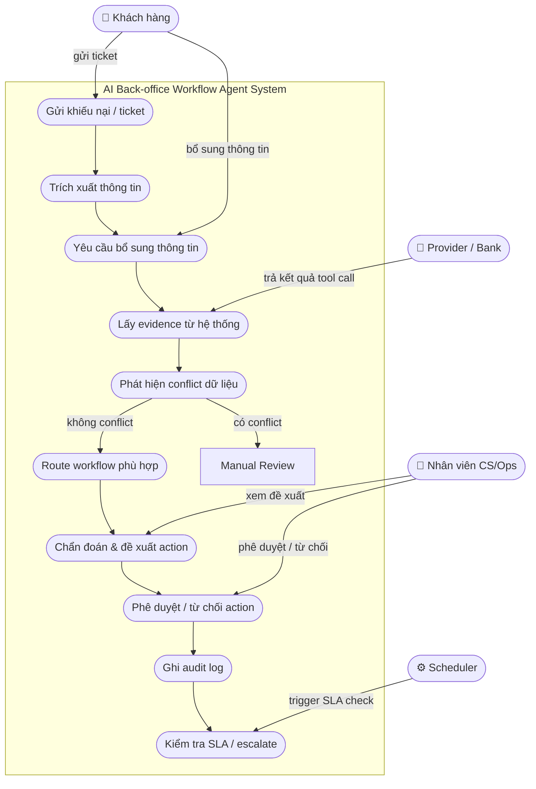

# Sơ đồ Use Case – AI Back-office Workflow Agent Fintech

> **Version:** 2.0 · **Cập nhật:** 2026-05-27

---

## Actors

| Actor | Vai trò |
|---|---|
| **Khách hàng** | Gửi khiếu nại, bổ sung thông tin khi được yêu cầu |
| **Nhân viên CS/Ops** | Xem đề xuất, phê duyệt hoặc từ chối action ảnh hưởng tiền |
| **Scheduler** | Trigger kiểm tra SLA và escalate tự động |
| **Provider / Bank** | Cung cấp dữ liệu evidence khi agent gọi tool |

---

## Use Case Diagram

---

## Danh sách Use Case chi tiết

### UC1 – Gửi khiếu nại / ticket
- **Actor:** Khách hàng
- **Mô tả:** Khách hàng gửi khiếu nại qua kênh CS. Ticket được đưa vào hệ thống agent.
- **Input:** Nội dung khiếu nại tự do (text)
- **Output:** Case mới với trạng thái `NEW`

### UC2 – Trích xuất thông tin
- **Actor:** Agent (LLM)
- **Mô tả:** Agent phân tích nội dung khiếu nại, trích xuất các trường cần thiết.
- **Trường trích xuất:** `user_id`, `transaction_id`, `order_id`, `bill_code`, `service_type`, `issue_type`
- **Trạng thái:** `NEW` → `EXTRACTING`

### UC3 – Yêu cầu bổ sung thông tin
- **Actor:** Agent + Khách hàng
- **Mô tả:** Nếu thiếu `transaction_id` hoặc `service_type`, agent hỏi lại khách hoặc tìm trong lịch sử gần nhất.
- **Trạng thái:** `EXTRACTING` → `MISSING_INFO` → `FETCHING_EVIDENCE`

### UC4 – Lấy evidence từ hệ thống
- **Actor:** Agent + Provider/Bank
- **Mô tả:** Agent gọi các tool read-only để lấy dữ liệu từ các nguồn.
- **Tools được gọi:**
  - `get_transaction(transaction_id)`
  - `get_wallet_ledger(transaction_id)`
  - `get_train_provider_status(provider_ref_id)`
  - `get_utility_bill_status(bill_code)`
  - `get_refund_status(transaction_id)`
  - `get_reconciliation_status(transaction_id)`
- **Trạng thái:** `FETCHING_EVIDENCE`

### UC5 – Phát hiện conflict dữ liệu
- **Actor:** Agent (Rule Engine)
- **Mô tả:** So sánh chéo các source of truth. Nếu phát hiện mâu thuẫn, route sang manual review.
- **Ví dụ conflict:**
  - `wallet_ledger = debited` nhưng `transaction.status = pending`
  - `provider_status = success` nhưng `ticket_code = null`
- **Trạng thái:** `FETCHING_EVIDENCE` → `CONFLICT_DETECTED` → `MANUAL_REVIEW`

### UC6 – Route workflow phù hợp
- **Actor:** Agent (Workflow Router)
- **Mô tả:** Chọn workflow xử lý dựa trên `service_type` và `issue_type`.
- **Workflow hỗ trợ:**
  - `train_ticket_reconciliation`
  - `utility_bill_reconciliation`
  - `manual_review`

### UC7 – Chẩn đoán & đề xuất action
- **Actor:** Agent (Rule Engine) + Nhân viên CS/Ops
- **Mô tả:** Rule engine so sánh evidence và áp dụng rule nghiệp vụ, tạo draft đề xuất.
- **Draft outputs:**
  - `create_refund_request_draft`
  - `create_reconciliation_ticket_draft`
  - `draft_customer_response`
- **Trạng thái:** `DIAGNOSING` → `RECOMMENDING`

### UC8 – Phê duyệt / từ chối action
- **Actor:** Nhân viên CS/Ops
- **Mô tả:** Mọi action ảnh hưởng tiền thật bắt buộc qua human approval. Agent không tự execute.
- **SLA approval:**
  - Refund ≤ 500.000đ → 4 giờ → escalate ops_senior
  - Refund > 500.000đ → 2 giờ → escalate ops_manager
  - Reconciliation ticket → 8 giờ
- **Trạng thái:** `AWAITING_APPROVAL` → `APPROVED` / `REJECTED`

### UC9 – Ghi audit log
- **Actor:** System
- **Mô tả:** Ghi lại toàn bộ quá trình xử lý: mọi state transition, tool call, conflict, decision, approval.
- **Bắt buộc với:** mọi action, mọi transition, mọi conflict phát hiện.

### UC10 – Kiểm tra SLA / escalate
- **Actor:** Scheduler
- **Mô tả:** Scheduler bên ngoài định kỳ kiểm tra các case quá SLA và tự động escalate.
- **Trigger:** Case ở trạng thái `AWAITING_APPROVAL` hoặc `AWAITING_PROVIDER` quá deadline.

---

## Nguyên tắc thiết kế cốt lõi

| # | Nguyên tắc |
|---|---|
| 1 | LLM không được quyết định tiền |
| 2 | Ledger / provider / refund table mới là evidence |
| 3 | Mọi workflow phải là state machine có route rõ |
| 4 | State transition không được nhảy cóc bước |
| 5 | Refund chỉ được tạo draft, không execute |
| 6 | Execute money action cần human approval theo phân quyền và SLA |
| 7 | Approval packet không chứa `model_confidence` |
| 8 | Nếu các source conflict nhau → không diagnosis → route manual review |
| 9 | Mọi action phải idempotent và audit được |
| 10 | Eval phải đo cả trajectory, tool call, conflict detection, decision và approval |

---

## Source of truth ưu tiên

| Thứ tự | Source | Ghi chú |
|---|---|---|
| 1 | `wallet_ledger` | Source of truth cao nhất về tiền trong ví |
| 2 | `refund_table` | Source of truth về trạng thái hoàn tiền |
| 3 | `provider_status` | Source of truth về dịch vụ đã cấp |
| 4 | `transaction_record` | Metadata giao dịch, có thể lag |
